# Sombrero Edge Control - Consolidated Deployment Runbook 🚀

## Table of Contents

1. [Overview](#overview)
2. [Three-Tier Deployment Pipeline](#three-tier-deployment-pipeline)
3. [Prerequisites](#prerequisites)
4. [Environment Setup](#environment-setup)
5. [Stage 1: Packer Build (Golden Image)](#stage-1-packer-build-golden-image)
6. [Stage 2: Terraform Deploy (Infrastructure)](#stage-2-terraform-deploy-infrastructure)
7. [Stage 3: Ansible Configure (Post-Deployment)](#stage-3-ansible-configure-post-deployment)
8. [Output Passing Between Stages](#output-passing-between-stages)
9. [Environment-Specific Configurations](#environment-specific-configurations)
10. [Verification & Smoke Tests](#verification--smoke-tests)
11. [Troubleshooting Guide](#troubleshooting-guide)
12. [Rollback Procedures](#rollback-procedures)
13. [Deployment Tracking & Metrics](#deployment-tracking--metrics)
14. [Quick Reference Commands](#quick-reference-commands)

---

## Overview

This runbook provides the complete, authoritative guide for deploying the Sombrero Edge Control jump host ("jump-man") to Proxmox using a three-tier deployment pipeline. The system achieves **90% faster deployments** (30 seconds vs 5-10 minutes) through the use of pre-built golden images.

### Key Specifications

- **VM Name**: jump-man
- **Base OS**: Ubuntu 24.04 LTS
- **Resources**: 2 vCPUs, 2GB RAM + 1GB floating, 32GB disk
- **Network**: Static IP per environment
- **Node**: lloyd (Proxmox host)
- **Template ID**: 1001 (Packer-built golden image)

### Deployment Duration

- **Golden Image Build**: ~5 minutes (one-time per update)
- **VM Deployment**: ~30 seconds
- **Post-Configuration**: ~2-3 minutes
- **Total Time to Production**: < 4 minutes (after initial image build)

---

## Three-Tier Deployment Pipeline

```mermaid
graph TB
    A[1️⃣ Packer Build] --> B[Golden Image Template]
    B --> C[2️⃣ Terraform Deploy]
    C --> D[VM Instance]
    D --> E[3️⃣ Ansible Configure]
    E --> F[🎯 Production Ready]

    A --> A1[Template ID: 1001]
    C --> C1[VM IP & SSH Info]
    E --> E1[Service Status]

    A1 -.-> C
    C1 -.-> E
    E1 -.-> F
```



### Pipeline Stages Summary

| Stage | Tool | Purpose | Duration | Outputs |
|-------|------|---------|----------|---------|
| **Build** | Packer + Ansible | Create golden image with Docker pre-installed | ~5 min | Template ID, Pre-installed tooling |
| **Deploy** | Terraform | Clone template & provision infrastructure | ~30 sec | VM IP, SSH keys, inventory data |
| **Configure** | Ansible | Instance-specific setup & hardening | ~2-3 min | Service status, final configuration |

---

## Prerequisites

### Local Development Machine

- **Terraform**: >= 1.13.0
- **Packer**: >= 1.14.0 (for building templates)
- **Ansible**: >= 2.15.0 (for post-deployment)
- **mise**: Tool version manager (recommended)
- **Git**: Repository access
- **SSH**: Key pair generated (ED25519 recommended)

### Proxmox Infrastructure

- **Proxmox VE**: Cluster operational
- **Network Bridge**: vmbr0 configured
- **Storage**: Sufficient space for VM and template
- **API Access**: Token created with appropriate permissions
- **Node**: 'lloyd' available and healthy

### Environment Variables Required

```bash
# Proxmox API Configuration
export TF_VAR_pve_api_url="https://your-proxmox:8006/api2/json"
export TF_VAR_pve_api_token="terraform@pve!token=xxxxxxxx-xxxx-xxxx-xxxx-xxxxxxxxxxxx"
export TF_VAR_proxmox_insecure="true"  # For self-signed certificates

# SSH Configuration
export TF_VAR_ci_ssh_key="ssh-ed25519 AAAAC3NzaC1lZDI1NTE5AAAAI-example-key ansible@jump-man"

# Packer Variables (for template building)
export PKR_VAR_proxmox_url="${TF_VAR_pve_api_url}"
export PKR_VAR_proxmox_username="root@pam"
export PKR_VAR_proxmox_password="changeme"
export PKR_VAR_proxmox_node="lloyd"
```

---

## Environment Setup

### Step 1: Configure mise Environment

```bash
# Copy example configuration
cp .mise.local.toml.example .mise.local.toml

# Edit with your values
vim .mise.local.toml

# Verify variables are loaded (mise auto-loads from .mise.local.toml)
mise env | grep TF_VAR
```

### Step 2: Verify Connectivity

```bash
# Test Proxmox API access
curl -k ${TF_VAR_pve_api_url}/version

# Test SSH access to Proxmox node (if needed for debugging)
ssh root@proxmox-host "qm list"
```

---

## Stage 1: Packer Build (Golden Image)

### Purpose
Build a reusable VM template with all base software pre-installed, eliminating runtime configuration delays.

### Pre-built Software
- Docker CE 24.0.7+ with Compose plugin
- Git, tmux, curl, wget, gpg
- Python3, jq, net-tools
- QEMU guest agent
- Basic security hardening

### Build Commands

```bash
# Navigate to Packer directory
cd packer/

# Validate Packer configuration
packer validate ubuntu-server-numbat-docker.pkr.hcl

# Build the golden image (one-time)
packer build -var-file=variables.pkrvars.hcl ubuntu-server-numbat-docker.pkr.hcl

# Alternative: Use mise task
mise run deploy-packer
```

### Expected Output

```json
# Automatically saved to: deployments/outputs/packer-outputs.json
{
  "template_id": "1001",
  "template_name": "ubuntu-server-numbat-docker",
  "build_time": "2025-01-02T14:30:00Z",
  "docker_version": "24.0.7",
  "packer_version": "1.14.1"
}
```

### Verification

```bash
# Verify template exists in Proxmox
ssh root@proxmox-host "qm list | grep 1001"
# Should show: 1001 ubuntu-server-numbat-docker

# Check template details
ssh root@proxmox-host "qm config 1001 | grep -E 'name|memory|cores'"
```

---

## Stage 2: Terraform Deploy (Infrastructure)

### Purpose
Clone the golden image template and provision the VM with environment-specific configuration.

### Deployment Commands

```bash
# Navigate to environment directory
cd infrastructure/environments/production/

# Initialize Terraform (first time only)
terraform init
# OR: mise run prod-init

# Validate configuration
terraform validate
# OR: mise run prod-validate

# Review execution plan
terraform plan
# OR: mise run prod-plan

# Deploy infrastructure
terraform apply
# OR: mise run prod-apply

# Alternative: Full pipeline with tracking
mise run deploy-terraform
```

### What Gets Created

1. **VM from Template**: Clones template ID 1001
2. **Network Configuration**: Static IP assignment
3. **Cloud-init**: Minimal bootstrap (SSH keys, hostname)
4. **Resource Allocation**: CPU, memory, disk configuration

### Expected Output

```json
# Automatically saved to: deployments/outputs/terraform-outputs.json
{
  "vm_ip": "192.168.10.250",
  "vm_hostname": "jump-man",
  "vm_id": "150",
  "ssh_user": "ansible",
  "ssh_key_path": "~/.ssh/jump-man-key",
  "ansible_inventory": {
    "all": {
      "hosts": {
        "jump-man": {
          "ansible_host": "192.168.10.250",
          "ansible_user": "ansible"
        }
      }
    }
  }
}
```

### Quick Verification

```bash
# Test SSH connectivity
ssh ansible@192.168.10.250 'hostname'
# Expected: jump-man

# Check Docker is pre-installed
ssh ansible@192.168.10.250 'docker --version'
# Expected: Docker version 24.0.7, build afdd53b
```

---

## Stage 3: Ansible Configure (Post-Deployment)

### Purpose
Apply instance-specific configuration and security hardening that couldn't be included in the golden image.

### Configuration Applied

- Advanced firewall rules (nftables/iptables)
- User-specific configurations
- Environment-specific settings
- Security hardening
- Service configurations
- Monitoring setup

### Deployment Commands

```bash
# Ansible inventory is auto-generated from Terraform outputs
# via 'terraform output -raw ansible_inventory'

# Run Ansible playbook
cd ansible/
ansible-playbook -i inventory/production playbooks/post-deploy.yml

# Alternative: Use mise task
mise run deploy-ansible
```

### Expected Output

```json
# Automatically saved to: deployments/outputs/ansible-results.json
{
  "deployment_status": "success",
  "configured_services": ["docker", "mise", "uv", "nftables"],
  "docker_status": "running",
  "user_groups": ["ansible", "docker"],
  "firewall_rules": 12,
  "completion_time": "2025-01-02T14:45:00Z"
}
```

---

## Output Passing Between Stages

### Automatic Data Flow


### File Locations

```bash
deployments/outputs/
├── packer-outputs.json     # Packer build results
├── terraform-outputs.json  # Terraform provision results
└── ansible-results.json    # Ansible configuration results
```

### Manual Output Inspection

```bash
# View Packer outputs
cat deployments/outputs/packer-outputs.json | jq '.'

# View Terraform outputs
cd infrastructure/environments/production/
terraform output -json > ../../../deployments/outputs/terraform-outputs.json

# View Ansible results
cat deployments/outputs/ansible-results.json | jq '.'
```

---

## Environment-Specific Configurations

### Network Configuration by Environment

| Environment | VM IP | Gateway | DNS | VM ID | Purpose |
|------------|-------|---------|-----|-------|---------|
| **Production** | 192.168.10.250 | 192.168.10.1 | 192.168.10.1 | 150 | Primary jump host |
| **Staging** | 192.168.10.252 | 192.168.10.1 | 192.168.10.1 | 152 | Testing & validation |
| **Development** | 192.168.10.251 | 192.168.10.1 | 192.168.10.1 | 151 | Development & experiments |

### Environment Variable Overrides

```bash
# Deploy to staging
ENV=staging mise run deploy-full

# Deploy to development
ENV=development mise run deploy-full

# Default is production
mise run deploy-full
```

### Environment-Specific Files

```bash
infrastructure/environments/
├── production/
│   ├── terraform.tfvars
│   └── cloud-init.jump-man.yaml
├── staging/
│   ├── terraform.tfvars
│   └── cloud-init.jump-man.yaml
└── development/
    ├── terraform.tfvars
    └── cloud-init.jump-man.yaml
```

---

## Verification & Smoke Tests

### Quick Connectivity Test

```bash
# Basic SSH test
mise run smoke-test-quick

# What it checks:
# - SSH connectivity
# - Hostname verification
# - Basic system status
```

### Full Smoke Test Suite

```bash
# Comprehensive validation
mise run smoke-test

# Tests performed:
# ✅ SSH connectivity
# ✅ Sudo privileges
# ✅ DNS resolution
# ✅ Docker service status
# ✅ Docker functionality
# ✅ QEMU guest agent
# ✅ System services health
```

### Docker-Specific Tests

```bash
# Verify Docker installation
mise run smoke-test-docker

# Manual verification
ssh ansible@192.168.10.250 << 'EOF'
  docker --version
  docker compose version
  docker run --rm hello-world
  docker ps -a
EOF
```

### Manual Verification Checklist

```bash
# 1. System basics
ssh ansible@192.168.10.250 'hostname'                    # jump-man
ssh ansible@192.168.10.250 'uname -r'                    # Kernel version
ssh ansible@192.168.10.250 'cat /etc/os-release'         # Ubuntu 24.04

# 2. Network configuration
ssh ansible@192.168.10.250 'ip addr show'                # Check IP
ssh ansible@192.168.10.250 'ip route'                    # Check routes
ssh ansible@192.168.10.250 'resolvectl status'           # DNS config

# 3. Services status
ssh ansible@192.168.10.250 'sudo systemctl status docker'
ssh ansible@192.168.10.250 'sudo systemctl status qemu-guest-agent'

# 4. Cloud-init status
ssh ansible@192.168.10.250 'sudo cloud-init status'      # Should show "done"
```

---

## Troubleshooting Guide

### Common Issues and Solutions

#### Issue: SSH Connection Timeout

**Symptoms**: Cannot SSH to VM, connection times out

**Diagnosis**:
```bash
# From Proxmox host
qm status 150                    # Check VM status
qm guest cmd 150 network-get-interfaces  # Check guest network
```

**Solutions**:
1. Verify VM is running: `qm start 150`
2. Check network configuration in VM
3. Verify firewall rules aren't blocking SSH
4. Check SSH keys are correctly configured

#### Issue: Cloud-init Degraded State

**Symptoms**: Services not starting, configuration incomplete

**Diagnosis**:
```bash
ssh ansible@192.168.10.250 'sudo cloud-init status --long'
ssh ansible@192.168.10.250 'sudo journalctl -u cloud-init --no-pager'
ssh ansible@192.168.10.250 'sudo cat /var/log/cloud-init-output.log'
```

**Solutions**:
1. Known issue - migrating to Ansible for configuration
2. Most services work despite degraded status
3. Run Ansible playbook for complete configuration

#### Issue: Template Not Found

**Symptoms**: Terraform fails with "template 1001 not found"

**Diagnosis**:
```bash
ssh root@proxmox-host "qm list | grep template"
```

**Solutions**:
1. Build template with Packer: `mise run deploy-packer`
2. Verify template ID matches Terraform configuration
3. Check template is on correct Proxmox node

#### Issue: Docker Not Starting

**Symptoms**: Docker service fails to start

**Diagnosis**:
```bash
ssh ansible@192.168.10.250 'sudo systemctl status docker'
ssh ansible@192.168.10.250 'sudo journalctl -u docker --no-pager'
ssh ansible@192.168.10.250 'sudo dockerd --debug'  # Manual debug mode
```

**Solutions**:
1. Check storage driver compatibility
2. Verify kernel modules loaded
3. Check for conflicting firewall rules
4. Reinstall Docker if necessary

#### Issue: API Authentication Failed

**Symptoms**: Terraform/Packer fails with 401 Unauthorized

**Diagnosis**:
```bash
curl -k -H "Authorization: PVEAPIToken=${TF_VAR_pve_api_token}" \
  ${TF_VAR_pve_api_url}/version
```

**Solutions**:
1. Regenerate API token in Proxmox
2. Verify token has correct permissions
3. Check token format: `user@realm!tokenid=secret`
4. Update `.mise.local.toml` with new token

### Debug Mode Commands

```bash
# Terraform debug
TF_LOG=DEBUG mise run prod-plan

# Packer debug
PACKER_LOG=1 packer build ubuntu-server-numbat-docker.pkr.hcl

# Ansible verbose mode
ANSIBLE_VERBOSITY=3 ansible-playbook playbooks/post-deploy.yml

# Cloud-init debug
ssh ansible@192.168.10.250 'sudo cloud-init collect-logs'
ssh ansible@192.168.10.250 'sudo tar -xzf /var/log/cloud-init.tar.gz'
```

### Log File Locations

**On Jump-man VM**:
- `/var/log/cloud-init.log` - Cloud-init main log
- `/var/log/cloud-init-output.log` - User-data script output
- `/var/log/syslog` - System messages
- `/var/log/auth.log` - SSH authentication attempts

**On Proxmox Host**:
- `/var/log/pve/tasks/` - Proxmox task logs
- `/var/log/pve-firewall.log` - Firewall logs

**Local Machine**:
- `deployments/outputs/*.json` - Pipeline outputs
- `.terraform/terraform.tfstate` - Terraform state
- `packer/packer.log` - Packer build logs (if PACKER_LOG=1)

---

## Rollback Procedures

### Emergency VM Destruction

```bash
# Immediate rollback - destroy VM only
cd infrastructure/environments/production/
terraform destroy -target=module.jump_man -auto-approve

# Complete infrastructure teardown
terraform destroy -auto-approve
```

### Rollback to Previous State

```bash
# View state history
terraform state list
terraform state show module.jump_man

# Import existing VM if state is lost
terraform import module.jump_man.proxmox_vm_qemu.vm 150

# Restore from backup (if using remote state)
terraform state pull > terraform.tfstate.backup
```

### Template Rollback

```bash
# List available templates
ssh root@proxmox-host "qm list | grep template"

# Use previous template ID in terraform.tfvars
vim infrastructure/environments/production/terraform.tfvars
# Change: template_id = 1000  # Previous version

# Redeploy with old template
mise run prod-apply
```

### Clean Slate Procedure

```bash
# 1. Destroy all resources
cd infrastructure/environments/production/
terraform destroy -auto-approve

# 2. Clean local state
rm -rf .terraform terraform.tfstate*

# 3. Remove VM from Proxmox (if destroy failed)
ssh root@proxmox-host "qm stop 150 && qm destroy 150"

# 4. Clean up SSH known hosts
ssh-keygen -R 192.168.10.250

# 5. Rebuild from scratch
mise run deploy-full
```

---

## Deployment Tracking & Metrics

### Initialize Deployment Record

```bash
# Start tracked deployment
mise run deployment-start
# Creates: deployments/checklists/YYYY-MM-DD-HH-MM-deployment.md

# Work through deployment with tracking
mise run deploy-full-tracked
```

### Metrics Collection

The system automatically tracks:
- **Deployment Duration**: Total time from start to finish
- **Phase Timing**: Duration of each stage (Packer/Terraform/Ansible)
- **Success Rate**: Historical deployment success percentage
- **Issue Frequency**: Common problems and their occurrence rate

### View Analytics

```bash
# Show deployment metrics dashboard
mise run deployment-metrics

# Example output:
📊 Deployment Analytics Dashboard
==================================
📈 Total Deployments: 15
✅ Success Rate: 93% (14/15)
⏱️ Average Duration: 4m 23s
🚀 Fastest Deployment: 3m 12s
🐌 Slowest Deployment: 8m 45s
```

### Manual Metrics Entry

Add to your deployment checklist:
```markdown
### Process Metrics 📊
- **Total Deployment Time**: 4m 30s
- **Packer Build**: N/A (used existing template)
- **Terraform Apply**: 32s
- **Ansible Configure**: 2m 45s
- **Verification Tests**: 1m 13s
- **Issues Encountered**: 0
- **Automation Coverage**: 95%
```

---

## Quick Reference Commands

### Complete Pipeline Commands

```bash
# Full deployment (all stages)
mise run deploy-full

# With specific template
mise run deploy-full TEMPLATE_ID=1001

# Tracked deployment with metrics
mise run deploy-full-tracked

# Environment-specific
ENV=staging mise run deploy-full
```

### Individual Stage Commands

```bash
# Stage 1: Build golden image
mise run deploy-packer

# Stage 2: Deploy infrastructure
mise run deploy-terraform

# Stage 3: Configure with Ansible
mise run deploy-ansible
```

### Verification Commands

```bash
# Quick connectivity test
mise run smoke-test-quick

# Full test suite
mise run smoke-test

# Docker-specific tests
mise run smoke-test-docker

# View deployment outputs
mise run deployment-verify
```

### Troubleshooting Commands

```bash
# Check VM status
ssh root@proxmox-host "qm status 150"

# View cloud-init logs
ssh ansible@192.168.10.250 'sudo cloud-init status --long'

# Emergency destroy
terraform destroy -target=module.jump_man -auto-approve

# Debug mode deployment
TF_LOG=DEBUG mise run prod-apply
```

### Maintenance Commands

```bash
# Update golden image
cd packer/ && packer build ubuntu-server-numbat-docker.pkr.hcl

# Backup Terraform state
cp terraform.tfstate terraform.tfstate.backup

# Clean deployment outputs
rm -f deployments/outputs/*.json

# Update documentation
mise run docs
```

---

## Appendix: File Locations

### Configuration Files
- `.mise.local.toml` - Environment variables
- `packer/variables.pkrvars.hcl` - Packer variables
- `infrastructure/environments/*/terraform.tfvars` - Terraform variables
- `ansible/inventory/hosts.yml` - Ansible inventory

### Output Files
- `deployments/outputs/packer-outputs.json` - Template build results
- `deployments/outputs/terraform-outputs.json` - Infrastructure details
- `deployments/outputs/ansible-results.json` - Configuration status

### Documentation
- `deployments/RUNBOOK.md` - This consolidated runbook
- `deployments/checklists/` - Historical deployment records
- `docs/deployment/` - Additional deployment documentation
- `docs/troubleshooting/` - Detailed troubleshooting guides

### Scripts
- `scripts/smoke-test.sh` - Verification test suite
- `scripts/restart-vm-ssh.sh` - SSH service restart utility

---

## Support & Contributions

For issues, improvements, or questions about this runbook:

1. Check existing deployment records in `deployments/checklists/`
2. Review ADRs in `docs/decisions/`
3. Create an issue in the repository
4. Update this runbook with lessons learned

---

**Last Updated**: 2025-09-06
**Version**: 1.0.0
**Status**: Production Ready 🚀
