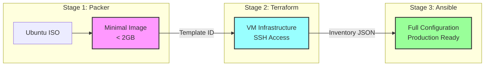

# Project Roadmap

*Sombrero-Edge-Control Infrastructure Pipeline*
*Last Updated: September 18, 2025*
*Overall Completion: 75%*

## Project Vision

Deploy a secure, high-performance jump host ("jump-man") on Proxmox using a three-stage pipeline with complete tool separation, achieving sub-minute deployments through minimal golden images, pure infrastructure provisioning, and comprehensive configuration management.

---

## Phase 1: Foundation (✅ 95% Complete)

*Timeline: Completed August 2024 - September 2025*

### ✅ Completed Tasks

- [x] **Repository Setup** - Initial structure and git configuration
- [x] **Terraform VM Module** - Parameterized, reusable VM provisioning module
- [x] **Cloud-init Integration** - User-data and vendor-data injection system
- [x] **Memory Ballooning** - 2GB dedicated + 1GB floating configuration
- [x] **Static Networking** - Fixed IP 192.168.10.250/24 implementation
- [x] **SSH Security** - ED25519 key-only authentication
- [x] **Basic Documentation** - README, CHANGELOG, initial guides

### ⏳ Pending Tasks

- [ ] **Performance Baseline** - Measure legacy deployment times
- [ ] **State Management** - Move from local to remote state

---

## Phase 2: Pipeline Separation Architecture (🆕 65% Complete)

*Timeline: January 2025 - February 2025*

### ✅ Completed Tasks

- [x] **Architecture Decision** - ADR-20250118 pipeline separation documented
- [x] **Packer Strategy** - Minimal golden image approach defined
- [x] **Documentation Updates** - All docs aligned with new architecture
- [x] **Ansible Configuration Guide** - Comprehensive playbook structure
- [x] **Deployment Checklist** - Three-stage deployment process

### ⏳ Pending Tasks

- [ ] **Minimal Packer Template** 🔴 - Remove Docker and tools from image
- [ ] **Simplify Cloud-init** 🔴 - Reduce to SSH-only configuration
- [ ] **Ansible Collection Cleanup** - Remove duplicate ansible/ directory
- [ ] **Pipeline Integration** - Clean handoffs between stages
- [ ] **Performance Validation** - Measure separated pipeline speed

---

## Phase 3: Minimal Golden Images (⏳ 40% Complete)

*Timeline: January 2025 - February 2025*

### ✅ Completed Tasks

- [x] **Packer Configuration** - Ubuntu 24.04 template builder exists
- [x] **Template Tagging** - Metadata and version tracking system
- [x] **Documentation** - Minimal image strategy documented

### ⏳ Pending Tasks

- [ ] **Remove Application Software** 🔴 - Strip Docker, dev tools from Packer
- [ ] **Minimize Package List** - Only OS, cloud-init, qemu-guest-agent
- [ ] **Image Size Optimization** - Target < 2GB image size
- [ ] **Build Time Optimization** - Target < 7 minute builds
- [ ] **Template Versioning** - Semantic versioning implementation

---

## Phase 4: Pure Infrastructure with Terraform (⏳ 60% Complete)

*Timeline: January 2025 - February 2025*

### ✅ Completed Tasks

- [x] **VM Module** - Reusable, parameterized module
- [x] **Static Networking** - Fixed IP configuration
- [x] **Backend Override** - Local state for development
- [x] **Terraform Outputs** - Ansible inventory generation

### ⏳ Pending Tasks

- [ ] **Minimal Cloud-init** 🔴 - Reduce to SSH-only configuration
- [ ] **Remove Script References** - No docker-install.sh, firewall-setup.sh
- [ ] **Clean Handoff** - Template ID input, inventory JSON output
- [ ] **Provider Optimization** - Parallel resource creation
- [ ] **State Management** - Remote backend for production

---

## Phase 5: Ansible as Single Source of Truth (⏳ 85% Complete)

*Timeline: January 2025 - February 2025*

### ✅ Completed Tasks

- [x] **Collection Structure** - basher83.automation_server created
- [x] **Role Architecture** - 10+ specialized roles implemented
- [x] **Docker Role** - Complete container runtime configuration
- [x] **Security Roles** - Firewall, SSH hardening, fail2ban
- [x] **Validation Roles** - vm_smoke_tests, docker_validation
- [x] **Development Tools Role** - mise, uv, nodejs configuration
- [x] **Playbook Hierarchy** - Master playbook with phases

### ⏳ Pending Tasks

- [ ] **Remove Duplicate Directory** 🔴 - Delete old ansible/ structure
- [ ] **Dynamic Inventory** - Terraform provider integration
- [ ] **Molecule Testing** - Role-level unit tests
- [ ] **Idempotency Validation** - All roles fully idempotent
- [ ] **Collection Publishing** - Galaxy distribution setup

---

## Phase 6: Three-Stage Pipeline Integration (⏳ 30% Complete)

*Timeline: February 2025*

### ✅ Completed Tasks

- [x] **Mise Task Structure** - Tasks for each stage defined
- [x] **Documentation** - Three-stage deployment checklist

### ⏳ Pending Tasks

- [ ] **Packer Output Handling** 🔴 - Template ID to Terraform variable
- [ ] **Terraform to Ansible** 🔴 - Inventory JSON generation
- [ ] **End-to-End Task** - mise run deploy-full implementation
- [ ] **Independent Validation** - Each stage testable alone
- [ ] **Performance Metrics** - Timing for each stage
- [ ] **Rollback Procedures** - Stage-specific recovery

---

## Phase 7: Documentation & Standards (✅ 90% Complete)

*Timeline: Ongoing*

### ✅ Completed Tasks

- [x] **Documentation Structure** - Logical directory organization
- [x] **17 ADRs** - Including pipeline separation decision
- [x] **Pipeline Separation Docs** - Complete refactoring strategy
- [x] **Packer Documentation** - Minimal golden image guide
- [x] **Ansible Configuration Guide** - Comprehensive playbook docs
- [x] **Updated Deployment Checklist** - Three-stage process
- [x] **Updated PRP** - Reflects new architecture

### ⏳ Pending Tasks

- [ ] **Component Documentation** - README for each role/module
- [ ] **API Documentation** - Module interfaces and contracts
- [ ] **Operational Runbooks** - Day-2 operations guides

---

## Phase 8: Testing & Validation (⏳ 45% Complete)

*Timeline: February 2025 - March 2025*

### ✅ Completed Tasks

- [x] **Smoke Test Suite** - vm_smoke_tests Ansible role
- [x] **CI Workflow** - GitHub Actions validation
- [x] **MegaLinter Integration** - Code quality enforcement
- [x] **Pre-commit Hooks** - Local validation

### ⏳ Pending Tasks

- [ ] **Packer Testing** 🔴 - Validate minimal images
- [ ] **Terraform Testing** - Terratest implementation
- [ ] **Ansible Testing** - Molecule for each role
- [ ] **Integration Testing** - Stage handoff validation
- [ ] **Performance Testing** - < 60 second deployment
- [ ] **Independence Testing** - Each tool standalone

---

## Critical Path Items 🚨

### Immediate Blockers (Must Fix Now)

1. **Packer Image Refactoring** 🔴 - Remove Docker/tools for minimal image
2. **Cloud-init Simplification** 🔴 - Reduce to SSH-only configuration
3. **Ansible Directory Cleanup** 🔴 - Remove duplicate ansible/ folder

### High Priority (Week 1)

1. **Pipeline Handoffs** - Template ID and inventory JSON mechanisms
2. **Mise Task Updates** - Three-stage deployment tasks
3. **Performance Validation** - Measure separated pipeline speed

### Medium Priority (Week 2-3)

1. **Testing Each Stage** - Independent validation procedures
2. **Molecule Implementation** - Ansible role testing
3. **Terratest Setup** - Terraform module testing

---

## Success Metrics

### Phase Completion Targets

| Phase | Current | Target | Due Date |
|-------|---------|--------|----------|
| Foundation | 95% | 100% | Feb 2025 |
| Pipeline Separation | 65% | 100% | Feb 2025 |
| Minimal Images | 40% | 100% | Feb 2025 |
| Pure Infrastructure | 60% | 100% | Feb 2025 |
| Ansible Configuration | 85% | 100% | Feb 2025 |
| Pipeline Integration | 30% | 100% | Mar 2025 |
| Documentation | 90% | 95% | Ongoing |
| Testing | 45% | 90% | Mar 2025 |

### Key Performance Indicators

#### Tool Independence
#### Tool Independence
- [ ] Packer builds without Terraform/Ansible dependencies
  - DoD: packer build succeeds using only packer/; no external scripts
  - Artifact: template ID published to deployments/outputs/template.json
  - Tests: packer-validate and post‑build smoke in mise task `packer-validate`
- [ ] Terraform deploys with only template ID input
  - DoD: tf apply with -var template_id=<ID> only; no provisioners
  - Output: inventory.json emitted to deployments/outputs/
- [ ] Ansible configures with only inventory JSON input
  - DoD: ansible-playbook -i inventory.json site.yml completes idempotently
  - Idempotency: <= 0 changed tasks on second run
- [ ] Each tool has independent test suite
  - DoD: packer tests (smoke), Terraform (terratest), Ansible (molecule)
#### Performance Metrics

- [ ] Packer build time: < 7 minutes
- [ ] Terraform deployment: < 2 minutes
- [ ] Ansible configuration: < 5 minutes
- [ ] End-to-end deployment: < 60 seconds total

#### Quality Metrics

- [ ] Image size: < 2GB (currently ~4GB with Docker)
- [ ] Test coverage: > 80% per tool
- [ ] Zero coupling violations between tools
- [ ] Documentation: 100% of components documented

---

## Resource Allocation

### Current Team Focus

- **Infrastructure**: Cloud-init fixes, performance validation
- **Ansible**: Collection migration, smoke test integration
- **Testing**: Unit test implementation, CI/CD completion
- **Documentation**: Production README fix, role documentation

### Recommended Priorities

1. **Week 1**: Fix blockers, validate performance
2. **Week 2-3**: Ansible migration execution
3. **Week 4-6**: Testing and CI/CD completion
4. **Week 7-8**: Production validation and deployment

---

## Risk Register

### High Risks

| Risk | Impact | Mitigation |
|------|--------|------------|
| Performance claims false | Project credibility | Immediate validation required |
| Cloud-init files missing | Deployment failure | Create files immediately |
| Ansible migration stalled | Technical debt | Execute phase 1 now |

### Medium Risks

| Risk | Impact | Mitigation |
|------|--------|------------|
| No unit tests | Quality issues | Implement Terratest |
| Manual deployments | Human error | Automate pipeline |
| Security gaps | Compliance failure | Add validation tests |

---

## Next Sprint Objectives (Q4 2025)

### Sprint 1 (Sep Week 3-4)

- Refactor Packer for minimal images
- Simplify cloud-init to SSH-only
- Clean up Ansible structure

### Sprint 2 (Oct Week 1-2)

- Implement pipeline handoffs
- Create three-stage mise tasks
- Validate tool independence

### Sprint 3 (Oct Week 3-4)

- Performance testing and validation
- Molecule and Terratest setup
- Production deployment trial

---

## Long-term Vision (2026)

### Q1 2026

- Multi-environment support
- Blue-green deployments
- Full observability stack

### Q2 2026

- Kubernetes integration
- Service mesh deployment
- Advanced security features

### Q3 2026

- Multi-cloud support
- Disaster recovery automation
- Compliance certifications

---

## Three-Stage Pipeline Architecture

*This roadmap is a living document and will be updated bi-weekly based on progress and priority changes.*

**Last Major Update**: September 18, 2025
**Next Review Date**: October 1, 2025
**Document Owner**: Infrastructure Team
**Architecture**: Pipeline Separation (ADR-20250918)
