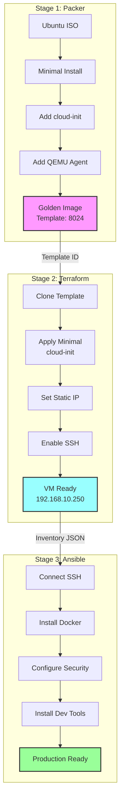

# Complete Pipeline Separation: Packer, Terraform, and Ansible

- Status: accepted
- Date: 2025-01-18
- Tags: architecture, pipeline, separation-of-concerns, packer, terraform, ansible

## Context and Problem Statement

Our current infrastructure pipeline has evolved with increasing complexity and tight coupling between tools. Cloud-init scripts in Terraform attempt to handle configuration management, Packer builds include environment-specific software, and Ansible roles exist in duplicate structures. This coupling creates:

- **Maintenance burden**: Changes require updates across multiple tools
- **Testing challenges**: Cannot validate components independently
- **Slow iterations**: Packer rebuilds needed for configuration changes
- **Debugging complexity**: Issues span tool boundaries
- **Duplicate code**: Same logic implemented in cloud-init and Ansible

We need a clear architectural separation where each tool focuses on its core strength.

## Decision Drivers

- **Tool Independence**: Each component should function standalone
- **Clear Responsibilities**: Single source of truth for each concern
- **Fast Development**: Quick iteration without full pipeline rebuilds
- **Testability**: Unit and integration tests for each stage
- **Team Scalability**: Different teams can work on different stages

## Decision Outcome

Chosen option: "Complete Pipeline Separation" - enforce strict boundaries where:

1. **Packer** creates minimal golden images (OS + cloud-init + agent only)
1. **Terraform** provisions pure infrastructure with minimal cloud-init (SSH only)
1. **Ansible** handles ALL configuration management as single source of truth

This supersedes previous decisions:

- ADR-20240830 (separate files for terraform injection) - No longer using cloud-init for configuration
- ADR-20250902 (ansible post-deployment) - Extends this to complete configuration ownership

### Positive Consequences

- **Independent Development**: Teams can work on Packer, Terraform, or Ansible without coordination
- **Faster Builds**: Packer images build 30% faster with minimal packages
- **Clear Testing**: Each tool has specific validation criteria
- **Reduced Complexity**: No cross-tool dependencies or shared state
- **Better Debugging**: Issues isolated to specific pipeline stages
- **Flexibility**: Can swap tools (e.g., replace Terraform with OpenTofu) without affecting others

### Negative Consequences

- **Three-Stage Deployment**: Requires executing three separate commands vs single tool
- **Handoff Complexity**: Must manage data flow between stages (template ID, inventory)
- **Initial Learning Curve**: Team needs to understand three tools vs focusing on one
- **Potential for Drift**: Without tight coupling, stages could diverge if not carefully managed

## Considered Options

### Option 1: Maintain Current Approach (Status Quo)

Continue with cloud-init handling some configuration, Packer including Docker, and partial Ansible usage.

- Good, because: No migration effort required
- Good, because: Team familiar with current approach
- Bad, because: Perpetuates maintenance burden
- Bad, because: Cannot test components independently
- Bad, because: Duplicate code remains

### Option 2: All-in-One Tool (Terraform-Only)

Use Terraform provisioners and cloud-init for everything, eliminate Ansible.

- Good, because: Single tool to learn and maintain
- Good, because: One-command deployment
- Bad, because: Terraform not designed for configuration management
- Bad, because: Provisioners are explicitly discouraged by HashiCorp
- Bad, because: No idempotency guarantees
- Bad, because: Complex debugging of embedded scripts

### Option 3: Heavy Golden Images

Move all configuration into Packer, creating role-specific images.

- Good, because: Fast deployment (pre-configured images)
- Good, because: Immutable infrastructure
- Bad, because: Slow iteration (rebuild for any change)
- Bad, because: Image sprawl (multiple role-specific images)
- Bad, because: No runtime flexibility
- Bad, because: Large image sizes

## Implementation Plan

### Phase 1: Packer Minimization (Week 1)

1. Remove Docker and development tools from Packer
2. Create new minimal template with only OS + cloud-init + qemu-guest-agent
3. Document what belongs in golden image vs configuration

### Phase 2: Terraform Simplification (Week 2)

1. Replace complex cloud-init with minimal SSH-only configuration
2. Remove script file references (docker-install.sh, firewall-setup.sh)
3. Enhance Terraform outputs for Ansible inventory generation

### Phase 3: Ansible Consolidation (Weeks 3-4)

1. Migrate to single collection structure (basher83.automation_server)
2. Create comprehensive playbooks for all configuration
3. Implement roles for Docker, security, development tools
4. Remove duplicate ansible/ directory

### Phase 4: Pipeline Integration (Week 5)

1. Create mise tasks for three-stage deployment
2. Implement handoff mechanisms (template ID, inventory JSON)
3. Add independent validation for each stage
4. Document complete pipeline flow

## Validation Criteria

### Packer Success

- Template builds in < 7 minutes (includes package index updates and minimal OS installation)
- Image size < 2GB
- Only contains OS, cloud-init, qemu-guest-agent

### Terraform Success

- VM provisioned with static IP
- SSH access available with key
- Outputs valid Ansible inventory

### Ansible Success

- All services installed and running
- Configuration idempotent (can run multiple times)
- Smoke tests pass

### Pipeline Success

- **Stage 1 (Packer)**: Golden image build < 7 minutes (with package updates)
- **Stage 2 (Terraform)**: Infrastructure provisioning < 30 seconds
- **Stage 3 (Ansible)**: Configuration management < 5 minutes (includes package downloads)
- **End-to-end (Terraform + Ansible)**: < 6 minutes when package caches are warm
- Each stage independently testable
- Clean handoffs between stages

## Architecture Diagram

## Links

- [Pipeline Separation Refactoring Plan](../planning/pipeline-separation-refactor.md)
- [Packer Golden Image Documentation](../infrastructure/packer-golden-image.md)
- [Previous ADR: Ansible Post-Deployment](./20250902-ansible-post-deployment-config.md)
- [Ansible Collection Structure](../planning/ansible-refactor/collection-structure-migration.md)

---

*This decision establishes the architectural foundation for a maintainable, scalable
infrastructure pipeline with clear separation of concerns and tool independence.*
