# CI/CD Pipeline Workflow for Infrastructure Deployment

This document outlines the recommended CI/CD workflow for the Packer → Terraform → Ansible infrastructure pipeline, following industry best practices for immutable infrastructure deployment.

## 🏗️ **Pipeline Architecture Overview**

```mermaid
graph TB
    A[Code Changes] --> B[Git Push/PR]
    B --> C[CI Pipeline Trigger]
    C --> D[1️⃣ Packer Build Stage]
    D --> E[2️⃣ Terraform Plan Stage]
    E --> F[Manual Approval Gate]
    F --> G[3️⃣ Terraform Apply Stage]
    G --> H[4️⃣ Ansible Configuration Stage]
    H --> I[5️⃣ Smoke Tests]
    I --> J[Deployment Complete]

    D --> D1[Golden Image Registry]
    G --> G1[Infrastructure State]
    H --> H1[Configuration Status]
    I --> I1[Test Results]
```



## 🔄 **Workflow Stages**

### **Stage 1: Golden Image Building (Packer)**

**Triggers:**

- Changes to `packer/` directory
- Changes to `ansible/playbooks/packer-provision.yml`
- Manual trigger for security updates
- Scheduled monthly rebuilds

**Actions:**

```bash
# Validate Packer template
packer validate packer/ubuntu-server-numbat-docker.pkr.hcl

# Build golden image with timestamped name
packer build packer/ubuntu-server-numbat-docker.pkr.hcl

# Tag and document the new template
# Template ID and metadata stored in outputs
```

**Outputs:**

- New VM template with timestamp
- Template metadata (ID, build time, installed software versions)
- Build logs and artifacts

**Success Criteria:**

- ✅ Packer build completes successfully
- ✅ All Ansible tasks execute without errors
- ✅ Golden image contains expected software (Docker, nvm, mise, uv)
- ✅ Template is properly tagged for dynamic selection

### **Stage 2: Infrastructure Planning (Terraform)**

**Triggers:**

- Changes to `infrastructure/` directory
- New Packer golden image available
- Manual deployment requests

**Actions:**

```bash
# Initialize and plan infrastructure changes
terraform init
terraform plan -out=tfplan

# Validate plan for expected changes
# Check if new golden image will be used
terraform show -json tfplan | jq '.planned_values.root_module.resources'
```

**Outputs:**

- Terraform plan file
- Infrastructure change summary
- Template selection confirmation (latest vs. fallback)

**Success Criteria:**

- ✅ Terraform plan completes without errors
- ✅ Plan shows expected resource changes
- ✅ Dynamic template selection working correctly
- ✅ No unexpected infrastructure modifications

### **Stage 3: Manual Approval Gate**

**Purpose:** Human oversight for production changes

**Review Checklist:**

- [ ] Infrastructure changes are expected and documented
- [ ] Golden image is recent and tested
- [ ] No security vulnerabilities in planned deployment
- [ ] Rollback plan is documented and ready
- [ ] Maintenance window approved (if required)

**Approval Process:**

- Technical lead review required for production
- Automated approval for development/staging environments
- Emergency override process documented

### **Stage 4: Infrastructure Deployment (Terraform)**

**Actions:**

```bash
# Apply approved infrastructure changes
terraform apply tfplan

# Capture outputs for Ansible stage
terraform output -json > ../deployments/outputs/terraform-outputs.json

# Generate Ansible inventory
terraform output -raw ansible_inventory > ../ansible/inventory/hosts.yml
```

**Outputs:**

- Deployed infrastructure (VMs, networks, etc.)
- Ansible inventory file
- Deployment metadata
- Infrastructure state updates

**Success Criteria:**

- ✅ Terraform apply completes successfully
- ✅ VM boots from golden image correctly
- ✅ SSH connectivity established
- ✅ Ansible inventory generated properly

### **Stage 5: Configuration Management (Ansible)**

**Actions:**

```bash
# Wait for VM to be fully ready
ansible all -i inventory/hosts.yml -m wait_for_connection

# Run post-deployment configuration
ansible-playbook -i inventory/hosts.yml playbooks/post-deploy.yml

# Verify golden image components
ansible all -i inventory/hosts.yml -m setup
```

**Outputs:**

- Configuration status and logs
- Service verification results
- Deployment completion markers

**Success Criteria:**

- ✅ Ansible connectivity successful
- ✅ Post-deployment tasks complete
- ✅ All services running and healthy
- ✅ Golden image components verified

### **Stage 6: Smoke Testing & Validation**

**Actions:**

```bash
# Run comprehensive smoke tests
./scripts/smoke-test.sh

# Validate deployment completeness
mise run deploy-verify

# Check service health and functionality
```

**Test Categories:**

- **Connectivity Tests:** SSH, network access
- **Service Tests:** Docker, development tools
- **Security Tests:** SSH hardening, firewall rules
- **Functionality Tests:** Tool availability, user permissions

**Success Criteria:**

- ✅ All smoke tests pass
- ✅ Services respond correctly
- ✅ Security posture verified
- ✅ Development environment ready

## 🔀 **Branching Strategy**

### **Branch Protection Rules**

- `main` branch requires PR review
- No direct pushes to `main`
- All CI checks must pass before merge
- Signed commits recommended

### **Development Workflow**

```bash
# Feature development
git checkout -b feature/packer-enhancement
# Make changes...
git commit -s -m "feat(packer): add Node.js via nvm"
git push origin feature/packer-enhancement
# Create PR → CI runs → Review → Merge
```

### **Hotfix Workflow**

```bash
# Emergency fixes
git checkout -b hotfix/security-patch
# Apply critical fix...
git commit -s -m "fix(security): update base packages"
# Fast-track approval process
```

## 🚨 **Rollback Procedures**

### **Infrastructure Rollback (Terraform)**

```bash
# Emergency rollback
mise run deploy-rollback

# Or manual rollback to previous state
terraform plan -destroy
terraform destroy -auto-approve
```

### **Golden Image Rollback (Packer)**

```bash
# Revert to previous template in Terraform
# Update template_id variable to previous known-good image
terraform plan -var="template_id=1000"
terraform apply
```

## 🔍 **Monitoring & Alerting**

### **Pipeline Health Monitoring**

- Build success/failure rates
- Deployment frequency and duration
- Error patterns and trending
- Resource utilization during builds

### **Alert Conditions**

- ❌ Packer build failures
- ❌ Terraform plan errors
- ❌ Ansible connectivity issues
- ❌ Smoke test failures
- ⚠️  Long-running deployments
- ⚠️  Resource quota approaching limits

### **Notification Channels**

- Slack/Teams for team notifications
- Email for critical failures
- Dashboard for real-time status
- Log aggregation for detailed analysis

## 🔐 **Security Considerations**

### **Secrets Management**

- Use cloud-native secret managers
- Never commit secrets to version control
- Rotate secrets regularly
- Audit secret access patterns

### **Access Control**

- Role-based access to CI/CD systems
- Least privilege for service accounts
- Multi-factor authentication required
- Regular access reviews

### **Security Scanning**

- Vulnerability scanning in pipeline
- Container image security checks
- Infrastructure security validation
- Dependency vulnerability checks

## 📊 **Metrics & KPIs**

### **Performance Metrics**

- **Pipeline Duration:** Target < 30 minutes end-to-end
- **Success Rate:** Target > 95% for main branch
- **Recovery Time:** Target < 15 minutes for rollbacks
- **Lead Time:** Code commit to production deployment

### **Quality Metrics**

- **Test Coverage:** Infrastructure and configuration tests
- **Security Score:** Based on security scanning results
- **Compliance:** Regulatory and internal standard adherence
- **Documentation Coverage:** Process and runbook completeness

### **Business Metrics**

- **Deployment Frequency:** How often we deploy
- **Change Failure Rate:** Percentage of deployments causing issues
- **Mean Time to Recovery:** Average time to resolve deployment issues
- **Infrastructure Drift:** Configuration drift detection and remediation

## 🎯 **Implementation Phases**

### **Phase 1: Foundation (Current)**

- [x] Manual pipeline with mise tasks
- [x] Packer + Ansible integration
- [x] Terraform dynamic template selection
- [x] Basic smoke testing

### **Phase 2: Automation**

- [ ] GitHub Actions workflow implementation
- [ ] Automated testing and validation
- [ ] Slack/Teams notifications
- [ ] Basic monitoring setup

### **Phase 3: Enhancement**

- [ ] Advanced security scanning
- [ ] Performance optimization
- [ ] Multi-environment support
- [ ] Automated rollback triggers

### **Phase 4: Maturity**

- [ ] Canary deployments
- [ ] Blue-green infrastructure
- [ ] Comprehensive observability
- [ ] Self-healing capabilities

## 📖 **Documentation Requirements**

### **Runbooks**

- Emergency response procedures
- Common troubleshooting guides
- Rollback procedures
- Contact information and escalation

### **Architecture Documentation**

- Infrastructure diagrams
- Data flow documentation
- Security architecture
- Disaster recovery plans

### **Process Documentation**

- Deployment checklists
- Change management procedures
- Testing protocols
- Compliance requirements

## 🚀 **Next Steps for Implementation**

1. **Test Current Pipeline:** Validate existing manual pipeline
2. **Create GitHub Workflows:** Implement basic CI/CD automation
3. **Add Monitoring:** Set up basic pipeline monitoring
4. **Security Integration:** Add security scanning and compliance checks
5. **Documentation:** Create comprehensive runbooks and procedures
6. **Training:** Team training on new processes and tools

## 📝 **Related Documentation**

- [Deployment Process](deployment-process.md)
- [Smoke Testing Implementation](smoke-testing-implementation.md)
- [Packer Configuration](../../packer/README.md)
- [Terraform Modules](../../infrastructure/README.md)
- [Ansible Playbooks](../../ansible/README.md)

---

**This workflow follows DevOps best practices for:**

- Immutable infrastructure
- Infrastructure as Code
- Continuous integration/deployment
- Security-first approach
- Comprehensive testing
- Rapid recovery capabilities

The goal is reliable, repeatable, and secure infrastructure deployments with minimal manual intervention and maximum visibility into the process.
