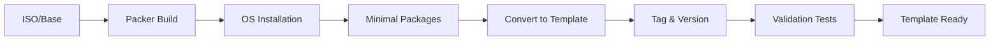

# Packer Golden Image Strategy

## Overview

This document defines the minimal golden image approach for the Sombrero Edge Control project, ensuring Packer creates universal, lightweight base images that serve as the foundation for our infrastructure pipeline.

## Design Principles

### 1. Minimal is Optimal

- **Include**: Operating system, cloud-init capability, qemu-guest-agent
- **Exclude**: Application software, configuration, environment-specific settings
- **Rationale**: Faster builds, universal images, clear separation of concerns

### 2. Immutable Foundation

- Golden images are versioned and immutable
- Configuration happens post-deployment via Ansible
- No environment-specific data in images

## Image Contents

### What Stays in the Golden Image

```hcl
# packer/ubuntu-server-minimal.pkr.hcl
provisioner "shell" {
  inline = [
    # System updates
    "sudo apt-get update",
    "sudo apt-get upgrade -y",

    # Essential packages only
    "sudo apt-get install -y qemu-guest-agent",
    "sudo apt-get install -y cloud-init",

    # Enable services
    "sudo systemctl enable qemu-guest-agent",
    "sudo systemctl enable cloud-init",

    # Clean up
    "sudo apt-get clean",
    "sudo apt-get autoremove -y"
  ]
}
```

### What Moves to Ansible

All application-level software and configuration:

| Component | Previous Location | New Location | Rationale |
|-----------|------------------|--------------|-----------|
| Docker CE | cloud-init/Packer | Ansible docker role | Environment-specific config |
| Development tools | cloud-init | Ansible development-tools role | Version management |
| Firewall rules | cloud-init | Ansible firewall role | Security policies |
| User configuration | cloud-init (partial) | Ansible + cloud-init | SSH keys via cloud-init, rest via Ansible |
| Package repositories | cloud-init | Ansible roles | Version control |

## Template Versioning Strategy

### Naming Convention

```
ubuntu-24.04-minimal-{timestamp}-{build_number}
```

Example: `ubuntu-24.04-minimal-20250118-001`

### Metadata Tags

Each template should be tagged in Proxmox with:

```json
{
  "os": "ubuntu-24.04",
  "type": "minimal",
  "builder": "packer",
  "build_date": "2025-01-18",
  "build_number": "001",
  "packer_version": "1.9.0"
}
```

### Version Selection

Terraform selects templates using:

1. **Explicit**: Specific template ID via variable
2. **Latest**: Query Proxmox for newest template with matching tags
3. **Validated**: Only use templates that pass smoke tests

## Build Process

### 1. Build Command

```bash
# Development build
mise run packer-build-dev

# Production build with validation
mise run packer-build-prod
```

### 2. Build Pipeline



### 3. Validation Tests

Post-build validation ensures:

- Template boots successfully
- cloud-init responds
- qemu-guest-agent communicates
- SSH service starts
- No configuration drift from minimal baseline

## Performance Metrics

### Build Time Targets

| Stage | Target Time | Current Time |
|-------|------------|--------------|
| OS Installation | 5 minutes | TBD |
| Package Installation | 1 minute | TBD |
| Template Conversion | 30 seconds | TBD |
| **Total Build Time** | **< 7 minutes** | TBD |

### Image Size Targets

| Component | Target Size | Current Size |
|-----------|------------|--------------|
| Base OS | 1.5 GB | TBD |
| cloud-init + agent | 100 MB | TBD |
| **Total Image Size** | **< 2 GB** | TBD |

## Integration Points

### Output to Terraform

```bash
# Packer outputs template ID
{
  "template_id": "8024",
  "template_name": "ubuntu-24.04-minimal-20250118-001"
}

# Terraform consumes via variable
terraform apply -var="template_id=8024"
```

### No Direct Ansible Integration

- Packer does NOT run Ansible provisioners
- Packer does NOT install Ansible dependencies
- Clean separation maintained

## Troubleshooting

### Common Issues

1. **Template Too Large**
   - **Symptom**: Build takes > 10 minutes
   - **Cause**: Too many packages included
   - **Solution**: Move packages to Ansible

2. **cloud-init Not Working**
   - **Symptom**: Terraform can't configure VM
   - **Cause**: cloud-init not properly installed
   - **Solution**: Ensure cloud-init package and service enabled

3. **No IP Reporting**
   - **Symptom**: Terraform can't get VM IP
   - **Cause**: qemu-guest-agent not running
   - **Solution**: Verify agent installation and enablement

## Migration from Current State

### Phase 1: Remove Complexity

1. Remove Docker installation from Packer
2. Remove development tools installation
3. Remove Ansible provisioner

### Phase 2: Create Minimal Template

1. New Packer configuration with minimal packages
2. Build and tag template
3. Validate boot and basic functionality

### Phase 3: Update Pipeline

1. Update Terraform to use new template
2. Update Ansible to handle all configuration
3. Validate end-to-end deployment

## Best Practices

### DO ✅

- Keep images minimal and universal
- Version templates with clear naming
- Tag templates with metadata
- Validate templates before use
- Document what's included and why

### DON'T ❌

- Install application software in Packer
- Include environment-specific configuration
- Use Packer provisioners for complex setup
- Embed secrets or credentials
- Create role-specific images (web server, database, etc.)

## Maintenance

### Regular Updates

- Rebuild golden images monthly for security patches
- Track Ubuntu base image updates
- Monitor Packer version compatibility

### Deprecation Policy

- Keep last 3 template versions
- Archive templates older than 90 days
- Document breaking changes in CHANGELOG

---

*Document Version: 1.0*
*Last Updated: 2025-01-18*
*Status: Implementation Pending*
