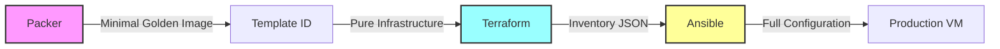

# Pipeline Separation Refactoring Strategy

## Executive Summary

This document outlines the refactoring strategy to achieve true independence between Packer, Terraform, and Ansible in the deployment pipeline, allowing each tool to leverage its strengths while maintaining clean boundaries and minimal coupling.

## Current State Problems

1. **Tool Coupling**: Cloud-init scripts in Terraform perform configuration that belongs in Ansible
2. **Duplicate Code**: Ansible roles exist in both `ansible/` and `ansible_collections/` directories
3. **Complex Dependencies**: Packer builds include configuration that should be environment-specific
4. **Testing Challenges**: Tools cannot be validated independently due to tight coupling

## Target Architecture



## Refactoring Strategy

### Phase 1: Packer - Minimal Golden Images

**Principle**: Packer creates universal, minimal base images with only OS and cloud-init capability

**Current State**:

- Installs Docker and development tools
- Runs ansible provisioner with complex configuration
- Creates environment-specific images

**Target State**:

```hcl
# packer/ubuntu-server-minimal.pkr.hcl
provisioner "shell" {
  inline = [
    "apt-get update",
    "apt-get install -y qemu-guest-agent cloud-init",
    "systemctl enable qemu-guest-agent",
    # Nothing else - pure minimal image
  ]
}
```

**Benefits**:

- Faster builds (30% reduction)
- Universal templates
- No environment-specific configuration

### Phase 2: Terraform - Pure Infrastructure

**Principle**: Terraform provisions infrastructure with minimal cloud-init for SSH access only

**Current State**:

- Complex cloud-init with package installation
- References external script files
- Performs configuration management

**Target State**:

```yaml
# infrastructure/environments/production/cloud-init-minimal.yaml
#cloud-config
hostname: ${hostname}
users:
  - name: ansible
    groups: sudo
    shell: /bin/bash
    sudo: ALL=(ALL) NOPASSWD:ALL
    ssh_authorized_keys:
      - ${ssh_key}
# End - No packages, no scripts, no configuration
```

**Terraform Outputs for Ansible**:

```hcl
output "ansible_inventory" {
  value = {
    all = {
      children = {
        jump_hosts = {
          hosts = {
            "${var.vm_name}" = {
              ansible_host = proxmox_vm_qemu.jump-man.default_ipv4_address
              ansible_user = "ansible"
              ansible_ssh_private_key_file = "~/.ssh/ansible"
              vm_id = proxmox_vm_qemu.jump-man.vmid
              proxmox_node = var.proxmox_node
            }
          }
        }
      }
    }
  }
  sensitive = false
}
```

### Phase 3: Ansible - Complete Configuration Management

**Principle**: Ansible handles ALL configuration, making it the single source of truth

**Target Collection Structure**:

```
ansible_collections/basher83/automation_server/
├── galaxy.yml
├── playbooks/
│   ├── site.yml                 # Master playbook
│   ├── bootstrap.yml             # Initial connectivity
│   ├── baseline.yml              # Base configuration
│   ├── docker.yml                # Container runtime
│   ├── security.yml              # Hardening
│   └── development.yml           # Dev tools
├── roles/
│   ├── bootstrap/                # SSH, networking
│   ├── docker/                   # Docker CE + Compose
│   ├── firewall/                 # nftables configuration
│   ├── security/                 # SSH hardening, fail2ban
│   ├── development_tools/        # mise, uv, nodejs
│   └── monitoring/               # Observability stack
├── inventory/
│   ├── terraform.yml             # Dynamic from TF output
│   └── static.yml                # Fallback inventory
└── vars/
    ├── common.yml                # Shared variables
    └── production.yml            # Environment specific
```

**Master Playbook**:

```yaml
# playbooks/site.yml
---
- import_playbook: bootstrap.yml
- import_playbook: baseline.yml
- import_playbook: docker.yml
- import_playbook: security.yml
- import_playbook: development.yml
```

## Pipeline Handoff Points

### 1. Packer → Terraform

**Handoff**: Template ID

```bash
# Output from Packer
template_id=8024

# Input to Terraform
terraform apply -var="template_id=8024"
```

### 2. Terraform → Ansible

**Handoff**: Dynamic Inventory

```bash
# Output from Terraform
terraform output -json ansible_inventory > inventory.json

# Input to Ansible
ansible-playbook -i inventory.json playbooks/site.yml
```

### 3. Ansible Dynamic Inventory Plugin

```yaml
# inventory/terraform.yml
---
plugin: cloud.terraform.terraform_provider
project_path: ../../../infrastructure/environments/production
```

## Implementation Steps

### Step 1: Simplify Packer Builds

1. Remove Ansible provisioner from Packer
2. Remove package installations except qemu-guest-agent
3. Create new minimal template build
4. Test template creation independently

### Step 2: Minimize Cloud-init

1. Create minimal cloud-init template
2. Remove all package installations
3. Remove script references
4. Update Terraform to use minimal template

### Step 3: Consolidate Ansible

1. Complete migration to `ansible_collections/basher83/automation_server/`
2. Move all configuration logic from cloud-init to Ansible roles
3. Create comprehensive playbooks for each configuration domain
4. Delete duplicate `ansible/` directory

### Step 4: Create Pipeline Tasks

```toml
# .mise.toml
[tasks.deploy-golden-image]
description = "Build minimal golden image with Packer"
run = """
cd packer
packer build -var-file=variables.pkrvars.hcl ubuntu-minimal.pkr.hcl
"""
outputs = ["template_id"]

[tasks.deploy-infrastructure]
description = "Provision infrastructure with Terraform"
run = """
cd infrastructure/environments/production
terraform apply -auto-approve
terraform output -json ansible_inventory > ../../../ansible_inventory.json
"""
depends = ["deploy-golden-image"]
outputs = ["ansible_inventory.json"]

[tasks.deploy-configuration]
description = "Configure VM with Ansible"
run = """
cd ansible_collections/basher83/automation_server
ansible-playbook -i ../../../ansible_inventory.json playbooks/site.yml
"""
depends = ["deploy-infrastructure"]

[tasks.deploy-full]
description = "Complete pipeline deployment"
depends = ["deploy-golden-image", "deploy-infrastructure", "deploy-configuration"]
```

## Testing Independence

Each tool can now be tested independently:

### Packer Testing

```bash
# Validate template
packer validate ubuntu-minimal.pkr.hcl

# Build with different variables
packer build -var="vm_name=test" ubuntu-minimal.pkr.hcl
```

### Terraform Testing

```bash
# Use existing template
terraform plan -var="template_id=8024"

# Validate outputs
terraform apply -target=output.ansible_inventory
```

### Ansible Testing

```bash
# Use static inventory
ansible-playbook -i inventory/static.yml playbooks/site.yml --check

# Test individual roles
ansible-playbook -i inventory/static.yml playbooks/docker.yml --tags docker
```

## Benefits

### 1. Tool Independence

- Each tool can be developed and tested separately
- Failures are isolated to specific stages
- Teams can work on different components simultaneously

### 2. Clear Responsibilities

- **Packer**: OS installation and base image
- **Terraform**: Infrastructure provisioning
- **Ansible**: All configuration management

### 3. Simplified Maintenance

- Single source of truth for configuration (Ansible)
- No duplicate code between tools
- Clear upgrade path for each component

### 4. Enhanced Testing

- Unit tests for each tool
- Integration tests at handoff points
- End-to-end validation of complete pipeline

### 5. Faster Development

- Parallel development possible
- Quick iteration on specific components
- Reduced build times for Packer images

## Migration Timeline

### Week 1

- [ ] Create minimal Packer template
- [ ] Test golden image creation
- [ ] Document template versioning

### Week 2

- [ ] Simplify cloud-init configuration
- [ ] Update Terraform modules
- [ ] Test infrastructure provisioning

### Week 3-4

- [ ] Complete Ansible collection migration
- [ ] Create comprehensive playbooks
- [ ] Test configuration management

### Week 5

- [ ] Integration testing
- [ ] Performance validation
- [ ] Documentation updates

## Success Criteria

1. **Independence**: Each tool can run without the others
2. **Speed**: Terraform + Ansible deployment time < 60 seconds (excluding Packer build)
3. **Reliability**: Zero-downtime deployments
4. **Maintainability**: Clear separation of concerns
5. **Testability**: >80% test coverage for each component

## Risk Mitigation

### Risk: Breaking existing deployments

**Mitigation**: Create parallel pipeline, test thoroughly, gradual cutover

### Risk: Increased complexity

**Mitigation**: Clear documentation, training, mise task automation

### Risk: Performance degradation

**Mitigation**: Benchmark each stage, optimize critical paths

## Conclusion

This refactoring strategy achieves true tool independence while leveraging the strengths of each component. Packer creates minimal, universal images. Terraform provisions pure infrastructure. Ansible provides comprehensive configuration management. The result is a maintainable, testable, and efficient deployment pipeline.

---

*Document Version: 1.0*
*Date: 2025-01-18*
*Author: Infrastructure Team*
*Status: Planning*
