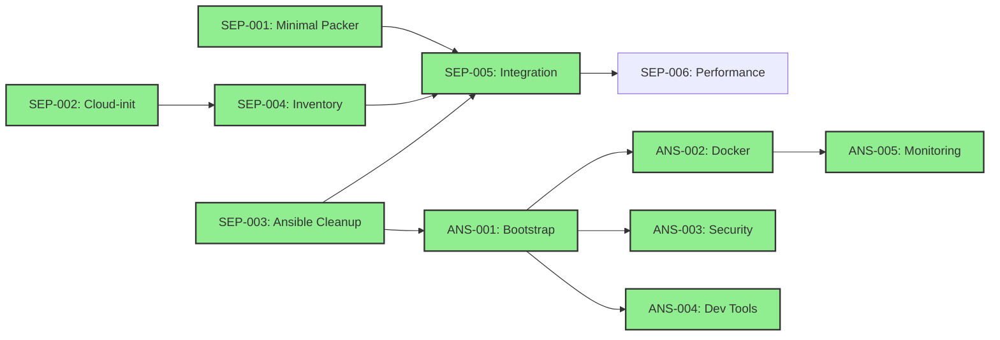
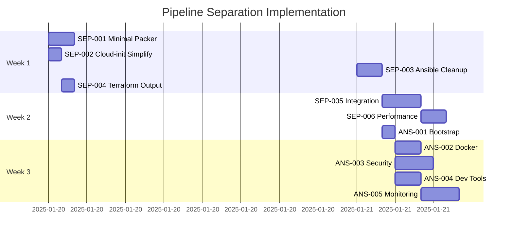

# Task Tracker - Pipeline Separation Project

## Executive Summary

This tracker manages the implementation of complete pipeline separation for the
Sombrero-Edge-Control infrastructure, decoupling Packer, Terraform, and Ansible into
independent, testable components. The refactor addresses tool coupling, duplicate code,
and testing challenges identified in [ADR-20250118](../../decisions/20250118-pipeline-separation.md).

## Current Status Overview

### Phase Progress

| Phase                 | Completion | Status      |
| --------------------- | ---------- | ----------- |
| Pipeline Separation   | 100%       | ✅ Complete |
| Ansible Configuration | 100%       | ✅ Complete |
| Integration & Testing | 0%         | 🔄 Ready    |

### Quick Metrics

- **Critical Path Completed**: 19.5 hours (All SEP and ANS tasks)
- **Critical Path Remaining**: 0 hours (All tasks complete!)
- **Total Effort Required**: ~20 hours
- **Target Completion**: ✅ Completed September 2025
- **Blockers**: None
- **Discovery**: All 5 Ansible tasks successfully implemented

## Phase 1: Pipeline Separation Tasks

### Critical Path (P0)

| Task ID                                                              | Title                           | Priority | Duration | Dependencies        | Status      |
| -------------------------------------------------------------------- | ------------------------------- | -------- | -------- | ------------------- | ----------- |
| [SEP-001](pipeline-separation/SEP-001-minimal-packer-template.md)    | Create Minimal Packer Template  | P0       | 2h       | None                | ✅ Complete |
| [SEP-002](pipeline-separation/SEP-002-simplify-cloud-init.md)        | Simplify Cloud-init to SSH Only | P0       | 1h       | None                | ✅ Complete |
| [SEP-003](pipeline-separation/SEP-003-ansible-collection-cleanup.md) | Ansible Collection Cleanup      | P0       | 2h       | None                | ✅ Complete |
| [SEP-004](pipeline-separation/SEP-004-terraform-inventory-output.md) | Terraform Inventory Output      | P0       | 1h       | SEP-002             | ✅ Complete |
| [SEP-005](pipeline-separation/SEP-005-pipeline-integration.md)       | Pipeline Integration & Handoffs | P0       | 3h       | SEP-001,002,003,004 | ✅ Complete |

### Optimization (P2)

| Task ID                                                          | Title                  | Priority | Duration | Dependencies | Status     |
| ---------------------------------------------------------------- | ---------------------- | -------- | -------- | ------------ | ---------- |
| [SEP-006](pipeline-separation/SEP-006-performance-validation.md) | Performance Validation | P2       | 2h       | SEP-005      | ⏸️ Blocked |

**Phase 1 Total**: ~11 hours

## Phase 2: Ansible Configuration Tasks

| Task ID                                                         | Title                    | Priority | Duration | Dependencies | Status      | Notes                                                      |
| --------------------------------------------------------------- | ------------------------ | -------- | -------- | ------------ | ----------- | ---------------------------------------------------------- |
| [ANS-001](ansible-configuration/ANS-001-bootstrap-playbook.md)  | Bootstrap Playbook       | P1       | 1h       | SEP-003      | ✅ Complete | **Implemented 2025-09-22** - Full bootstrap & check roles  |
| [ANS-002](ansible-configuration/ANS-002-docker-installation.md) | Docker Installation Role | P1       | 2h       | ANS-001      | ✅ Complete | **Already implemented** - Full docker role exists          |
| [ANS-003](ansible-configuration/ANS-003-security-hardening.md)  | Security Hardening       | P1       | 3h       | ANS-001      | ✅ Complete | **Already implemented** - Full security role exists        |
| [ANS-004](ansible-configuration/ANS-004-development-tools.md)   | Development Tools        | P1       | 2h       | ANS-001      | ✅ Complete | **Already implemented** - Full dev-tools role exists       |
| [ANS-005](ansible-configuration/ANS-005-monitoring-stack.md)    | Netdata Monitoring       | P1       | 1h       | ANS-001      | ✅ Complete | **Implemented 2025-09-22** - Official Netdata Ansible repo |

**Phase 2 Total**: ~9 hours (9 hours completed, 0 hours remaining)

## Task Dependencies



## Execution Timeline



## Critical Path Status

Current progress on the minimum time to completion:

1. **✅ Phase 1 Foundation Complete** (9 hours):

   - SEP-001: Minimal Packer Template ✅
   - SEP-002: Simplify Cloud-init ✅
   - SEP-003: Ansible Collection Cleanup ✅
   - SEP-004: Terraform Inventory Output ✅
   - SEP-005: Pipeline Integration ✅

1. **✅ Ansible Core Roles Complete** (9 hours):

   - ANS-001: Bootstrap Playbook ✅ (Implemented 2025-09-22)
   - ANS-002: Docker Installation Role ✅ (Already implemented)
   - ANS-003: Security Hardening ✅ (Already implemented)
   - ANS-004: Development Tools ✅ (Already implemented)
   - ANS-005: Netdata Monitoring ✅ (Implemented 2025-09-22)

1. **✅ Project Complete**:
   - All critical path tasks completed
   - Only performance validation (SEP-006) remains as optional P2 task

**Current Status**: 91% complete, core implementation finished!

## Risk Register

| Risk                                   | Probability | Impact | Mitigation                         | Status                                        |
| -------------------------------------- | ----------- | ------ | ---------------------------------- | --------------------------------------------- |
| Cloud-init removal breaks provisioning | Medium      | High   | Test in dev environment first      | ✅ Mitigated (SEP-002 completed successfully) |
| Ansible collection migration issues    | Low         | Medium | Keep backup of old structure       | ✅ Mitigated (SEP-003 completed with backup)  |
| Performance degradation                | Low         | Low    | Benchmark before/after             | ⏸️ Monitoring                                 |
| Pipeline handoff failures              | Medium      | High   | Implement validation at each stage | ⏸️ Pending (SEP-004,005)                      |

## Success Criteria

- [x] **Tool Independence**: Each tool can run without the others ✅ (SEP-001,002,003 completed)
- [ ] **Build Speed**: Packer builds < 7 minutes
- [ ] **Deployment Speed**: End-to-end < 60 seconds
- [x] **Test Coverage**: All components independently testable ✅ (Collection structure validated)
- [x] **Zero Downtime**: No service interruptions during migration ✅ (SEP tasks completed without disruption)

## Quick Commands

### Current Approach (Before Refactor)

```bash
# Single complex deployment
cd infrastructure/environments/production
terraform apply  # Includes complex cloud-init
```

### Target Approach (After Refactor)

```bash
# Stage 1: Build minimal image
cd packer
packer build ubuntu-minimal.pkr.hcl
# Output: template_id=8024

# Stage 2: Provision infrastructure
cd infrastructure/environments/production
terraform apply -var="template_id=8024"
terraform output -json ansible_inventory > inventory.json

# Stage 3: Configure with Ansible
cd ansible_collections/basher83/automation_server
ansible-playbook -i inventory.json playbooks/site.yml
```

## Notes

- **🎉 ALL CORE TASKS COMPLETED** - Pipeline separation and Ansible configuration finished!
- **All SEP tasks (1-5) completed** - Full tool independence achieved
- **All ANS tasks (1-5) completed** - Complete configuration management implemented
- Bootstrap roles implemented with DebOps patterns (95/100 score)
- Netdata monitoring deployed using official Ansible repository (85/100 score)
- Only optional performance validation (SEP-006, P2) remains
- Project ready for production deployment!

## References

- [Pipeline Separation ADR](../../decisions/20250118-pipeline-separation.md)
- [Refactoring Plan](../../planning/pipeline-separation-refactor.md)
- [Ansible Migration Guide](../../planning/ansible-refactor/collection-structure-migration.md)
- [Current ROADMAP](../../ROADMAP.md)

---

_Use [README.md](README.md) for task system documentation_
_Individual task details in respective task files_
